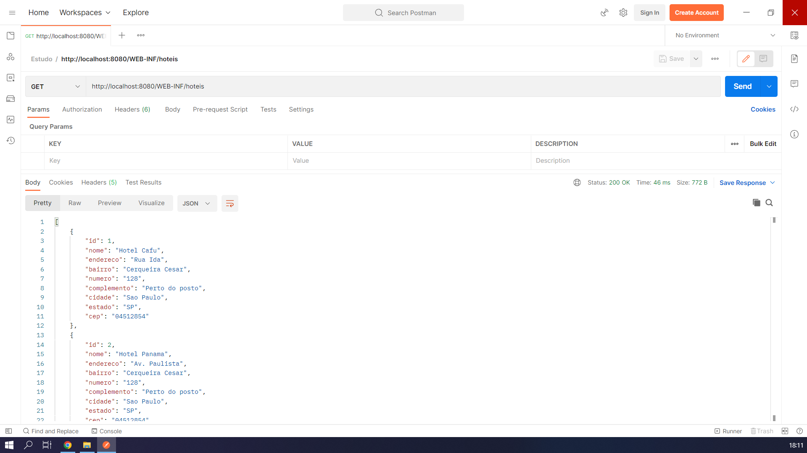

<h1 align="center">:file_cabinet: Sistemas Distribuídos</h1>

## :memo: Descrição
Foi desenvolvido um servidor java que irar entregar informações ao cliente, utilizando um hashmap para emular uma base de dados. Esse servidor foi desenvolvido com três métodos Rest (POST, GET, DELETE). Foi desenvolvido um cliente com PHP para consumir o serviço.

## :books: Funcionalidades
* Lista os dados fornecidos pelo server.
* Cadastro de novos dados.
* A possibilidade de apagar dados da lista.

## :wrench: Tecnologias utilizadas
* [Java](https://nodejs.org/en/https://www.java.com/pt-BR/)
* [Javascript ](https://developer.mozilla.org/pt-BR/docs/Web/JavaScript)
* [PHP](https://www.postman.com/)

## :wrench: Ferramentas utilizadas
* [XAMPP](https://www.apachefriends.org/pt_br/index.html)
* [NetBeans](https://netbeans.apache.org/download/index.html)
* [Postman](https://www.php.net/)
* [GlassFish](https://javaee.github.io/glassfish/download)

## :books: Adicionais
* Framework Jersey RESTful.

## :rocket: Rodando o projeto
Para rodar o repositório é necessário clonar o mesmo, dar o seguinte comando para iniciar o projeto:
```
  # Clone this repo
  $ git clone <https://github.com/Wesley-Sampaio/Sistemas-Distribuidos>
  
  # Abra o ServerRest e iniciar serviço com o GlassFish
  
  # Coloque o ClientePHP na pasta "htdocs" e inicie o XAMPP
```
## :soon: Implementação futura
* Mecanismo de busca na aplicação.
* Utilização de Mock Services WSDL.

## :framed_picture: Previews



## :satellite: Configurações adicionais ao projeto
Para executar o projeto você precisa configurar a porta do cliente para 9090 para que consiga rodar a aplicação.

## :satellite: Urls
* http://localhost:8080/WEB-INF/hoteis
* http://localhost:9090/ClientePHP/index.php
* http://localhost:9090/ClientePHP/form.php
